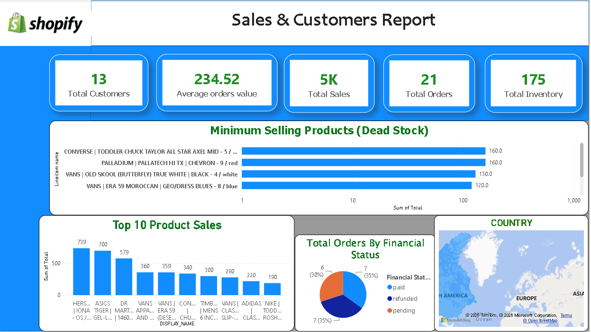

# Shopify E-commerce Sales & Customers Analytics Dashboard

##  Project Overview
This project demonstrates an end-to-end data engineering and business intelligence workflow using the **Modern Data Stack (MDS)**. The goal is to ingest real-time e-commerce data from a Shopify store, centralize it in a cloud data warehouse, and build an interactive Power BI dashboard to extract actionable business insights regarding sales performance, customer behavior, and inventory management.

---

##  Data Architecture & Pipeline
The project utilizes a modern analytics architecture to ensure seamless data flow and scalability:
1. **Data Source:** Shopify (E-commerce platform tracking customers, orders, inventory, and line items).
2. **Data Ingestion (ETL):** **Fivetran** automated pipelines to sync raw Shopify data into the warehouse without manual scripts.
3. **Data Warehousing:** **Snowflake** (Cloud Data Warehouse) used for storing, structuring, and transforming raw data into analytics-ready tables.
4. **Data Visualization:** **Power BI Desktop** connected directly to Snowflake to build an interactive dashboard.

---

##  Dashboard Preview
*Below is the screenshot of the interactive Sales & Customers Report:*

 

---

##  Key Business Metrics & Features

The dashboard focuses on five primary Key Performance Indicators (KPIs) to monitor store health:
* **Total Customers:** 13 unique customers engaging with the store.
* **Average Order Value (AOV):** $234.52, helping understand consumer spending patterns.
* **Total Sales:** $5K in cumulative revenue.
* **Total Orders:** 21 successful checkouts.
* **Total Inventory:** 175 items remaining in stock.

###  Key Insights & Visualizations:
* **Minimum Selling Products (Dead Stock):** A horizontal bar chart tracking low-performing items (e.g., Converse, Palladium, Vans) to help management identify dead stock, plan discounts, or optimize inventory holding costs.
* **Top 10 Product Sales:** A vertical column chart highlighting the highest revenue-generating products to optimize marketing focus.
* **Total Orders By Financial Status:** A breakdown showing the proportion of Paid (35%), Refunded (35%), and Pending (30%) transactions, critical for cash flow and fraud analysis.
* **Geographical Distribution:** An interactive map visual showcasing sales across global regions (America, Europe, etc.).

---

##  Tech Stack & Tools Used
* **Data Integration:** Fivetran
* **Data Warehouse:** Snowflake Cloud Data Platform
* **BI Tool:** Power BI Desktop
* **Data Transformations:** Power Query (Data cleaning, formatting columns, and renaming fields for corporate presentation)

---

##  Key Learnings & Takeaways
* Established an end-to-end cloud data pipeline connecting an e-commerce source to a cloud warehouse.
* Handled data transformations in Power BI to turn raw backend database schema into clear, readable corporate metrics (e.g., handling missing fields and renaming machine-generated underscores into business terms).
* Applied business concepts like **Dead Stock Analysis** to help retail businesses optimize supply chain decisions.

---
##  Author
* **Name:** Saundary Pareek
* **Role:** Aspiring Data Analyst / Business Intelligence Engineer
* **Connect with me:** https://www.linkedin.com/in/saundary-pareek/
